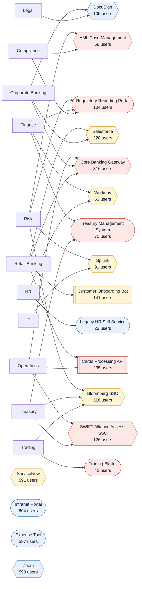

```mermaid
flowchart LR
    classDef t1 fill:#fde8e6,stroke:#c0392b,color:#12263f
    classDef t2 fill:#fff4d6,stroke:#d99a1c,color:#12263f
    classDef t3 fill:#e8f1fb,stroke:#2b6cb0,color:#12263f
    D0["Compliance"]
    D1["Corporate Banking"]
    D2["Finance"]
    D3["HR"]
    D4["IT"]
    D5["Legal"]
    D6["Operations"]
    D7["Retail Banking"]
    D8["Risk"]
    D9["Trading"]
    D10["Treasury"]
    A0{{"Core Banking Gateway<br/>316 users"}}:::t1
    D7 --> A0
    D1 --> A0
    D6 --> A0
    A1{{"SWIFT Alliance Access SSO<br/>126 users"}}:::t1
    D10 --> A1
    D6 --> A1
    A2(["Treasury Management System<br/>70 users"]):::t1
    D10 --> A2
    D2 --> A2
    A3(["Trading Blotter<br/>42 users"]):::t1
    D9 --> A3
    A4{{"AML Case Management<br/>68 users"}}:::t1
    D0 --> A4
    D8 --> A4
    A5{{"Workday<br/>53 users"}}:::t2
    D3 --> A5
    D2 --> A5
    A6{{"ServiceNow<br/>591 users"}}:::t2
    A7{{"Salesforce<br/>228 users"}}:::t2
    D1 --> A7
    D7 --> A7
    A8{{"Bloomberg SSO<br/>118 users"}}:::t2
    D9 --> A8
    D10 --> A8
    D8 --> A8
    A9{{"Splunk<br/>91 users"}}:::t2
    D4 --> A9
    D8 --> A9
    A10(["Intranet Portal<br/>604 users"]):::t3
    A11(["Expense Tool<br/>597 users"]):::t3
    A12(["Legacy HR Self Service<br/>23 users"]):::t3
    D3 --> A12
    A13[["Cards Processing API<br/>235 users"]]:::t1
    D6 --> A13
    D7 --> A13
    A14[["Customer Onboarding Bot<br/>141 users"]]:::t2
    D7 --> A14
    A15(["Regulatory Reporting Portal<br/>104 users"]):::t1
    D0 --> A15
    D2 --> A15
    D8 --> A15
    A16{{"DocuSign<br/>105 users"}}:::t3
    D5 --> A16
    D1 --> A16
    A17{{"Zoom<br/>590 users"}}:::t3
```
