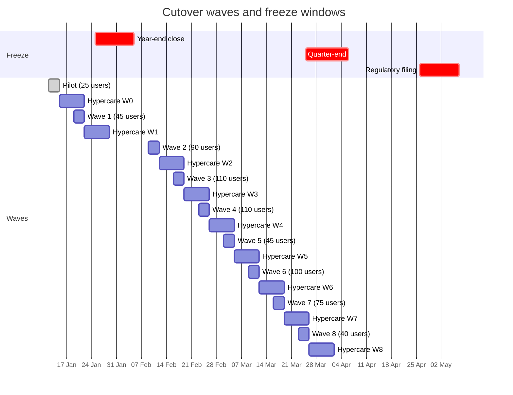

```mermaid
gantt
    title Cutover waves and freeze windows
    dateFormat YYYY-MM-DD
    axisFormat %d %b
    section Freeze
    Year-end close :crit, 2027-01-25, 2027-02-05
    Quarter-end :crit, 2027-03-25, 2027-04-06
    Regulatory filing :crit, 2027-04-26, 2027-05-07
    section Waves
    Pilot (25 users) :done,w0, 2027-01-12, 3d
    Hypercare W0 :after w0, 7d
    Wave 1 (45 users) :w1, 2027-01-19, 3d
    Hypercare W1 :after w1, 7d
    Wave 2 (90 users) :w2, 2027-02-09, 3d
    Hypercare W2 :after w2, 7d
    Wave 3 (110 users) :w3, 2027-02-16, 3d
    Hypercare W3 :after w3, 7d
    Wave 4 (110 users) :w4, 2027-02-23, 3d
    Hypercare W4 :after w4, 7d
    Wave 5 (45 users) :w5, 2027-03-02, 3d
    Hypercare W5 :after w5, 7d
    Wave 6 (100 users) :w6, 2027-03-09, 3d
    Hypercare W6 :after w6, 7d
    Wave 7 (75 users) :w7, 2027-03-16, 3d
    Hypercare W7 :after w7, 7d
    Wave 8 (40 users) :w8, 2027-03-23, 3d
    Hypercare W8 :after w8, 7d
```
